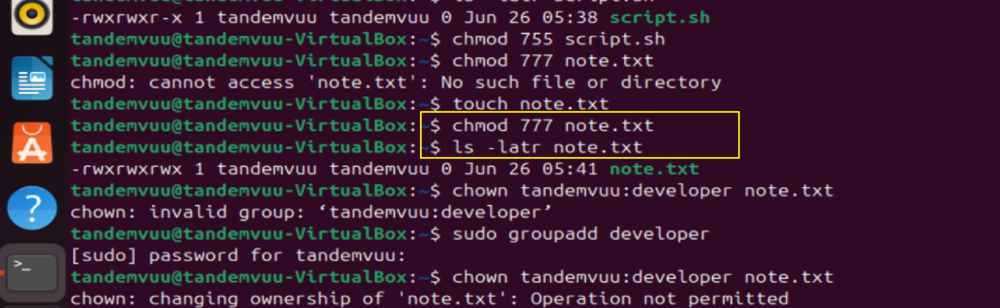
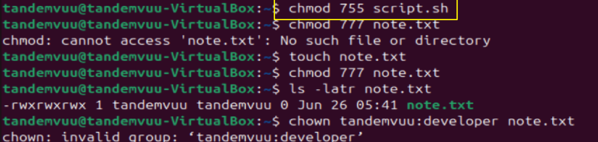

# User-Group-Admin
This project will help you understand Advanced linux commands featuring; how to Create and manage users, Group(s) and how to  modify group, user privileges and read write and execution access to files and direcotires...

### 1. Linux Numeric representation of permission

Open your terminal and run:
```bash
ls -latr
```
no permission=0 read=4 write=2 execute=1
rw= 4+2 =6
wx=2+1 =3
rwx=4+2+1 =7


##shorthand representation of permision
To explore this take this example; create a file


### 2. Create a File

To create a file:
```bash
touch script.sh
```


### 3. check permision level to file


Press

`
ls -latr script.sh
 `
 Now change or grant execution access for all users.
 using
` chmod +x script.sh`





### 4. Now check what the permission looks like.
`ls -latr script.sh`


another example;
 ```
chmod 755 script.sh
 ```

 ### 5 do thesame for noted .txt
 another example;
 ```
 chmod 777 note.sh
 ```

 `ls -latr notes.sh`
 


### 6. Change the ownership of a file wtih respect to  user, group


run:
```bash
chown john:developer filename.txt
```


### 8. Superuser privileges

To switch users;
```bash
sudo -i

```

Input `exit` to leave the shell


### 9 . Create user

```
sudo adduser johndoe
```


### 10. Grant administrative priviledges for user johndoe

```
sudo usermod -aG sudo johndoe

```


### 11. change password for user johndoe

```
sudo passwd johndoe

```

Log out to login to johndoe:
use `su johndoe`


### 12. Creating group and adding users to group
```
sudo groupadd developers


```


```
sudo usermod -aG developers johndoe

```


## Verify group users;
```
id johnoe

```
##Delete user
```
sudo userdel bamilola
```
### 13 Group permission

```
sudo chown :developers /home/tandemvuu/Document
```

```


```sudo chmod g+rw /home/tandemvuu/Document

```
 
## Miscellaneous tasks
create other users
 

create devop group


create folders for each users


## add userss to group


 give access to devop group
 

 
 
Refer to the included screenshots for visual guidance on these steps.

---

## License

This repository is open source and free to use for educational purposes.
